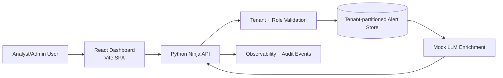

# Multi-tenant Alerting Prototype Architecture

## 1. Overview
This prototype demonstrates a tenant-isolated alerting system with a thin Python Ninja API, a mock enrichment stage, and a React dashboard optimized for alert browsing. The design prioritizes clarity over infrastructure complexity while still modeling the controls expected in a production SaaS security analytics platform.

## 2. Core Flow
1. The frontend sends a request with `X-Tenant-Id` and `X-User-Role` headers.
2. The Python Ninja endpoint validates the tenant and role before data access.
3. Only tenant-scoped records are loaded from the in-memory store.
4. Each alert passes through a mock LLM enrichment step that appends summary, risk score, and action guidance.
5. The paginated response is returned to the dashboard, which renders through a virtualized list container.

## 3. System Diagram

## 4. Tenant Isolation Model
- Tenant context is mandatory and explicit at the API boundary.
- The backend never accepts a tenant identifier from query parameters or request body data for alert filtering; only trusted headers are used in this prototype.
- The service layer rejects unknown tenants and invalid roles before any alert records are returned.
- Every alert item in the payload is tagged with its `tenant_id`, making isolation easy to validate in tests and logs.

## 5. Security Considerations
- Authenticate the caller before tenant resolution in production.
- Derive tenant membership from an identity token instead of raw headers.
- Log role, tenant, and request identifiers for auditability.
- Add rate limiting and response caching safeguards to prevent cross-tenant leakage through shared intermediaries.
- Redact sensitive customer content before enrichment requests when replacing the mock LLM step with a real provider.

## 6. Scaling Plan to 1k+ Tenants
- Replace the in-memory store with a partitioned database table keyed by tenant and event time.
- Move enrichment to an async worker queue so ingest and retrieval remain decoupled.
- Cache common dashboard queries per tenant with strict cache key scoping.
- Emit metrics per tenant for API latency, enrichment duration, and error rates.
- Introduce per-tenant quotas and backpressure rules for noisy tenants.

## 7. Tradeoffs and Roadmap
### Current Tradeoffs
- In-memory data keeps the demo simple but is not durable.
- Header-driven tenant context is useful for a prototype but not sufficient for production trust boundaries.
- Enrichment is synchronous, which keeps latency visible but increases response time.

### Phased Roadmap
1. Add JWT-based identity and RBAC enforcement.
2. Introduce a background worker for enrichment and retry policies.
3. Add Redis caching with tenant-aware keys.
4. Layer in OpenTelemetry traces, dashboards, and SLO alerts.
5. Expand role models to support admin vs analyst action permissions.
